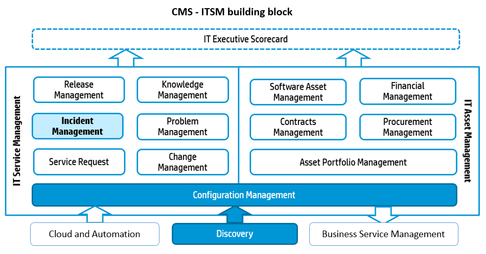

# What is CMS?

Configuration Management System (CMS) is a set of tools and databases that are used to manage the configuration data of an IT Service Provider. The CMS also includes information about Incidents, Problems, Known Errors, Changes and Releases; and may contain data about employees, suppliers, locations, business units, customers and users. The CMS includes tools for collecting, storing, managing, updating, and presenting data about all configuration items and their relationships. The CMS is maintained by Configuration Management process and is used by all IT Service Management (ITSM) Processes.

Configuration Management Database (CMDB), CMS, and ITSM are definitions introduced by the IT Information Library (ITIL), which is a body of best practices for IT. ITIL was first developed in 1989 by the UK’s Office of Government Commerce (OGC) and is currently in version 3. ITIL can be generally thought of as a loose set of guidelines for managing and operating IT. ITIL v3’s model emphasizes services and processes, and the interactions and transitions between them. Service operations are the set of interacting processes that culminate in the provision and availability of a service. Services may include a composite of fundamental processes as well as other services. ITSM is the set of processes that manage service operations. For example, the maintenance, update, and repair of service components.

